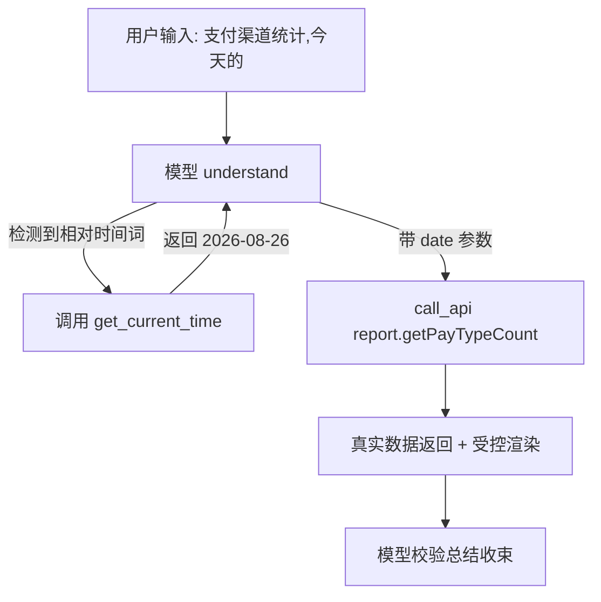

## 用户需求
用户发现「支付渠道统计,今天的」这类含相对时间词的请求，agent 会失败：弱模型要么把"今天的"当冗余词丢弃直接调 call_api（不带 date 参数），要么失败后反问用户"请告知具体日期"。

## 产品概述
为 agent 新增一个通用的时间查询工具 `get_current_time`，让模型在需要时间参数时自行调用获取服务器当前日期/时间，对齐 Claude Code「模型自查环境时间」的机制（官方 issue #8316 证实 Claude Code 拒绝在 system prompt 注入日期，靠模型调环境工具自查时间）。

## 核心功能
- 新增 `get_current_time` 工具：返回服务器当前日期（YYYY-MM-DD）、ISO 时间、时间戳。
- 工具描述以通用指令风格告知模型：用户口语含相对时间（今天/昨天/本周/本月/最近 N 天等）或需 date/timeRange 参数时，先调本工具取当前日期再自行换算，禁止丢弃相对时间词、禁止反问用户要具体日期。
- 模型在处理"支付渠道统计,今天的"时：先调 `get_current_time` 取 2026-08-26 → 再调 `call_api(report.getPayTypeCount, date:"2026-08-26")` 拿真实数据，不再丢词或反问。
- 全程零业务词写死、零中文意图正则、零映射表，符合"除 tools/skills 外不写死"红线（工具本身在 tools 范畴，属合法通用能力）。


## 技术栈
- 沿用现有 agent-server 技术栈：TypeScript + 现有工具注册机制（`listAgentTools` 单一事实来源 + `runAgentTool` 分支分发 + `mcp.ts` 复用）。
- 不引入任何新依赖，`new Date()` 原生实现。

## 实现方案
### 总体策略
对齐 Claude Code 方案 A：新增通用 `get_current_time` 工具，把"当前时间"作为模型可自查的环境能力暴露，而非服务端写死解析。模型遇到相对时间词时自主决定调用该工具，将结果换算为接口参数（date/timeRange）。这与现有 call_api/search_api_module 等工具注册方式完全一致，复用 `listAgentTools` 单一事实来源，MCP 出口自动暴露。

### 关键技术决策
1. **工具而非 system 注入**：用户已选路 A（对齐 Claude Code 自查机制），不注入当前日期到 staticGuide（那是路 B，属 Cursor/Claude web 做法）。工具方式让弱模型在工具描述引导下显式查时间，更符合"模型驱动"原则。
2. **复用 listAgentTools 单一事实来源**：chat.ts 的 `AGENT_TOOL_NAMES` 从 `listAgentTools()` 动态生成，getToolDefs 与 mcp.ts 均复用——只需在 `listAgentTools()` 增一项即全链路生效，无双份漂移风险。
3. **纯函数无副作用**：`runAgentTool` 分支用 `new Date()` 返回 JSON，无 IO、无外部调用、无错误分支（时间获取不会失败），性能 O(1)，零开销。
4. **描述不写死业务词**：工具描述仅描述通用时间语义（今天/昨天/本周/本月/最近 N 天 + date/timeRange 参数名），这些属通用时间副词与英文参数契约，不违反红线。

### 性能与可靠性
- `get_current_time` 执行成本可忽略（单次 `new Date()` + 格式化），不影响多轮循环耗时。
- 弱模型可能多一轮工具调用（先 get_current_time 再 call_api），属预期行为，换来正确时间参数，对比之前失败重试更优。

## 实现注意事项
- 保持 `TOOL_DESCRIPTIONS` 描述风格一致（动词开头 + "Use when"触发场景 + 边界说明）。
- `runAgentTool` 分支返回统一格式 JSON 字符串，与现有工具返回结构一致（便于模型解析）。
- 确认 `mcp.ts` 是否直接 import `listAgentTools` 复用（若是则无需改；若有独立列表需补登记）。
- 返回值建议含 `date`（YYYY-MM-DD）、`datetime`（ISO 8601）、`timestamp`（毫秒数），覆盖接口常见的 date/timeRange 两种参数形态。

## 架构设计

新增工具挂载在现有工具注册链路上，不改动 orchestrate 流程图结构。

## 目录结构
```
apps/agent-server/src/
├── tools.ts          # [MODIFY] ① TOOL_DESCRIPTIONS 新增 get_current_time 描述；② listAgentTools() 新增 AgentToolDef（name/description/parameters）；③ runAgentTool 新增 if 分支返回 new Date() 格式化的 JSON
├── mcp.ts            # [CHECK] 确认是否复用 listAgentTools；若独立列表需同步登记 get_current_time
└── chat.ts           # [NO CHANGE] AGENT_TOOL_NAMES 从 listAgentTools 动态生成，自动包含新工具（无需改）
```

## 关键代码结构
```typescript
// tools.ts 新增工具定义（风格对齐现有工具）
export const TOOL_DESCRIPTIONS = {
  // ...existing
  get_current_time:
    "获取服务器当前日期与时间（ISO 格式）。当用户口语含相对时间（今天/昨天/本周/本月/最近 N 天等）" +
    "或调用接口需要 date/timeRange 等时间参数时，先调用本工具取得当前日期，再自行换算为接口要求的参数；" +
    "禁止丢弃相对时间词、禁止反问用户要具体日期。",
};

// runAgentTool 新增分支
if (name === "get_current_time") {
  const now = new Date();
  return JSON.stringify({
    date: now.toISOString().slice(0, 10),
    datetime: now.toISOString(),
    timestamp: now.getTime(),
  });
}
```

