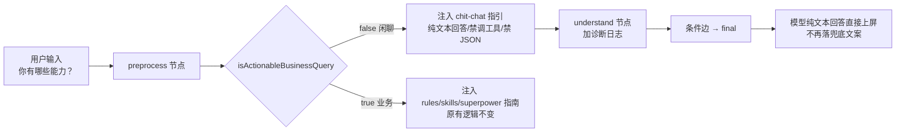

## 产品概述
修复影视后台管理智能助手在 /chat 中收到闲聊/能力询问类问题（如「你有哪些能力？」）时，被兜底文案「抱歉，我暂时无法回答这个问题。我是影视后台管理系统的智能助手……」吞掉、用户得不到有效回答的问题。要求此类问题得到正常的自然语言回答（如介绍自身可查询的业务能力），同时不破坏既有业务查询主链路。

## 核心功能
- 闲聊/能力询问类请求（actionableQuery=false）走自然语言回答路径，不再落入 final 兜底文案
- 回答内容可介绍智能助手能力：如查询用户列表、影片搜索统计、优惠活动配置等业务数据，并引导用户明确模块与操作
- 保持业务请求（如「查询用户列表」）主链路行为不变，不回归
- 增加模型原始输出的诊断日志，坐实「模型空文本 vs JSON 被清空」的根因，为后续优化提供依据


## 技术栈
- Node.js + TypeScript，LangGraph StateGraph 编排（apps/agent-server/src/chat.ts），PM2 托管 agent-server
- 模型链路：OpenCode Zen 免费链（当前 TokenHub 402）

## 实现方案
在 chat.ts 的 preprocess 节点，对 `actionableQuery=false`（闲聊/能力询问）分支注入一条轻量闲聊指引 system step，明确告知模型：本次为非业务请求，必须用纯自然语言回答，可介绍自身业务能力，禁止调用业务工具、禁止输出 JSON/工具调用描述形态文本；并在 understand 节点加一行诊断日志打印模型原始输出（text 前 200 字符 + toolCalls 数量），复测坐实根因后确认修复效果。

关键决策与理由：
1. **注入提示而非规则路由**：符合架构红线（design.md §7.4）——闲聊仅作模型输入前的轻量上下文，不抢在模型前路由工具。本次只是多给模型一条"如何回答闲聊"的输入提示，无关键词 if/else 路由。
2. **不修改 isActionableBusinessQuery 判定**：「能力」保持判为 false（闲聊），避免误入 `toolChoice=required` 的业务工具路径；同时把能力询问词表（有哪些操作/什么操作/可执行操作）保持原样，不扩大误判面。
3. **不改 final 兜底文案**：该文案仍是合理的最后防线，仅当模型持续无有效输出时兜底。
4. **诊断日志轻量落点**：在 understand 节点 result 返回前打印，不引入新依赖、不影响线上响应。

## 实现要点
- preprocess 节点（chat.ts:978-1090）：在 `if (actionableQuery) {...}` 之外补 `else` 分支，注入一条 `[workflow/chit-chat]` system step（置于全局指南之后、understand 调用前）。内容要点：本次为非业务请求（闲聊/能力询问/概念咨询），直接用自然语言回答，可介绍自身能力（如查询用户列表、影片搜索统计、优惠活动配置等），引导用户明确模块与操作；禁止调用 call_api / search_api_module / submit_understood_intent 等业务工具；禁止输出 JSON 或工具调用描述（如 {"tool_calls": ...}）；纯文本收束，不再续探。
- understand 节点（chat.ts:1205 附近）：在计算 firstRoundPlan 前后加 `console.log("[chat:understand] raw output ...", JSON.stringify(result.text || "").slice(0, 200), "toolCalls:", result.toolCalls?.length ?? 0)`，用于区分「空文本」与「JSON 被 validateFinalText 清空」。
- 验证回归：业务查询（用户列表/优惠活动配置）不受影响；闲聊（你有哪些能力？/你好/谢谢）返回自然语言。

## 架构设计
改动仅在 chat.ts 图内两处，不新增模块、不改数据流结构：



## 目录结构
```
apps/agent-server/src/chat.ts  # [MODIFY] 唯一修改文件
  - preprocess 节点：actionableQuery=false 分支新增 [workflow/chit-chat] 闲聊指引 system step（原 1046-1083 的 if 分支外补 else）
  - understand 节点：result 返回前新增模型原始输出诊断日志（text 前 200 字符 + toolCalls 数量）
```

## 验证步骤
1. `pm2 restart agent-server` 生效改动
2. 浏览器（apps/web vite dev 5173，账号 admin / 123456）发送「你有哪些能力？」→ 期望返回自然语言能力介绍（含业务查询引导），不再出现「抱歉，我暂时无法回答这个问题」
3. 查看 apps/agent-server/logs/agent-server-dev.out-37.log 确认诊断日志内容（区分空文本 / JSON 被清空），并复核「你好」「谢谢」等闲聊均正常
4. 回归：发送「查询用户列表」「查询优惠活动配置」确认业务链路无回归


## Agent Extensions
### MCP
- **chrome-devtools**
  - Purpose: 端到端验证修复效果——在浏览器打开 apps/web（vite dev 5173），登录测试环境账号（admin/123456），在 /chat 发送「你有哪些能力？」「你好」等闲聊问题及业务查询回归用例，抓取页面实际回复内容
  - Expected outcome: 确认闲聊问题返回自然语言能力介绍、业务查询无回归，替代人工验证，提供可复现证据
