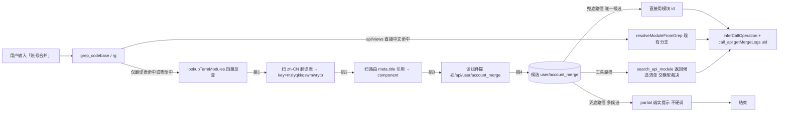

## 用户需求
落地 A+ 方案（此前已确认）：根治「账号合并」类**纯 i18n 页面中文定位断链**问题。核心诉求是**通用性**——不得新增任何「中文词→模块」映射表/索引等静态产物，后续新增项目（无论是否 i18n 架构）零适配代码。

## 产品概述
将模块定位从「grep 文本命中（api/views 直接中文）」升级为**实时源码反查**：grep 落空时对「中文术语 → i18n key → 路由 meta.title 引用 → 组件 → @/api import」做四跳反查，纯读当前项目源码，不留任何 JSON/索引/映射表。

## 核心功能
- 新增共享反查模块 `src/translation-lookup.ts`：输入中文术语（如「账号合并」），输出候选模块（id/路由/组件/菜单名/i18n key），四跳全部实时读源码
- 修复 `search_api_module`（tools.ts L1708）：翻译表命中不再丢弃，改返回完整反查链路交模型裁决
- 修复 `resolveModuleFromGrep`（workflow-orchestrate.ts）：新增 locales 命中分支，唯一候选直接用、多候选诚实 fallback、无候选保持原提示
- 零新增数据产物、零新依赖、纯源码驱动，符合「抛弃 aliases」红线

## 边界
- 不落地方案 X 的 build-module-catalog.mjs / module-catalog.ts / module-catalog-*.json
- 不改动用户已就绪的其他 plan（rules/KB 优化）
- 不改 C1 直接中文主路径（api/views 命中仍优先）


## 技术栈
- 现有 Node.js + TypeScript + LangGraph（apps/agent-server），**零新依赖**（原生 fs/path/regex）
- 验证脚本用 tsx 运行（`cd apps/agent-server && .\node_modules\.bin\tsx.cmd scripts/verify-translation-lookup.mjs`）
- 复用 output-tools.ts 翻译表目录结构/正则风格与 resolveModuleFromGrep 的 views→api import 正则

## 实现方案
### 总体策略
「账号合并」断链根因 = grep 链路两处缺陷：① search_api_module 的 isNoise 把 locales 命中判为噪声丢弃（连 key 都不给模型）；② resolveModuleFromGrep 只认 src/api 与 src/views 命中。A+ 新建共享函数完成四跳反查，两处复用，每次请求实时读源码、不留静态产物。

### 关键决策
- **共享函数 `lookupTermModules(term, root)`**：四跳——① 递归扫 `src/locales/lang/zh-CN/**/*.{ts,json}`（排除 en），正则 `([A-Za-z0-9_]+)\s*:\s*['"\`]{term}['"\`]` 收集 i18n key；② 递归扫 `src/router/routes/**/*.ts`，匹配 `title\s*:\s*t\(\s*['"]([^'"]+)['"]\s*\)` 的 key（leaf 或完整串 ∈ keys）→ 从同块提取 path/component（title 行前找，向前未果向后兜底）；③ 读 component 文件提 `@/api/xxx` import → 模块 id；④ 按模块 id 去重返回候选。
- **接入点 A（兜底路径，无模型）**：`resolveModuleFromGrep` 末尾新增分支 3——grepText 命中 `src[\\/]locales[\\/]` 时，解析 locales 行 `key: '中文'`（解析不到用 fallbackModule 场景词）调 lookupTermModules：唯一候选直接用、多候选返回 fallback（上层 partial 诚实提示，不硬调，防 termIndex「查询→paymentChannel」误命中重演）、无候选保持现状。
- **接入点 B（工具路径，有模型）**：`search_api_module` L1708 的「仅在翻译表发现」分支改调 lookupTermModules，有候选返回 `[翻译表反查] 候选清单`（模块 id + 路由 + 组件 + 来源说明）交模型 read_api_module/call_api 裁决；无候选保留原提示。
- **性能**：翻译表+路由文件数十个、每请求毫秒级；per-root 内存缓存（Map<root, Map<term, hits>> + 文件 mtime 失效重建，仅缓存反查结果，非静态产物），缓存命中 O(1)；反查仅在 grep 落空时触发，不热路径。
- **C3 纯英文架构**：无需适配——英文术语 grep 路由/API 名直接命中走现有分支；中文口语由模型自身翻译能力处理，反查函数只认源码文本不感知项目。

## 实现注意
- 红线一致：反查结果全部来自**当前项目源码实时解析**，零 JSON/索引/词表产物，按 codebaseRoot 隔离；工具路径交模型裁决、兜底路径唯一候选才用。
- 兼容性：rg 反斜杠与 grepCodebaseNative 正斜杠路径均需支持；翻译表 routes/ 子目录 ts/json 混合需递归；路由 title 若为 getTran 嵌套或直接中文则不进入反查（现有分支已覆盖）。
- 爆炸半径：仅在两处 grep 落空分支新增调用，C1 主路径（api/views 命中）不受影响；多候选不硬调；不写日志新格式（命中时按现有 steps 模式记 `[workflow/orchestrate] 翻译表反查命中 user/account_merge`）。

## 架构设计


## 目录结构
```
apps/agent-server/
├── src/
│   ├── translation-lookup.ts          # [NEW] 共享翻译表反查。lookupTermModules(term, root?): TranslationLookupHit[]；四跳实现 + per-root 内存缓存（mtime 失效）。导出 TranslationLookupHit 类型与 escapeRegExp 工具。
│   ├── workflow-orchestrate.ts        # [MODIFY] resolveModuleFromGrep（L283-306）末尾新增分支 3：locales 命中 → 调 lookupTermModules；唯一候选直接用、多候选返回 fallback、无候选保持原样；更新函数头注释（L279-282）。
│   └── tools.ts                       # [MODIFY] search_api_module（L1663-1739）L1708-1711「仅在翻译表发现」分支改调 lookupTermModules，有候选返回 [翻译表反查] 候选清单，无候选保留原提示。
├── scripts/
│   └── verify-translation-lookup.mjs  # [NEW] tsx 验证脚本：断言「账号合并→user/account_merge」「优惠活动配置→user/special_offer」「用户列表→account」「影片搜索统计→search」+ 唯一候选/多候选分支行为。
docs/agent/README.md                   # [MODIFY] 流程改进日志一行（日期+模块+要点+改动文件）。
```
说明：src/output-tools.ts 的 resolveI18nTitle 保持原样（key→中文方向，反查函数方向相反独立实现）；旧 data/module-api-catalog.json 运行时无引用，本次不动。

## 关键代码结构
```ts
// src/translation-lookup.ts —— 多模块依赖的核心契约
export interface TranslationLookupHit {
  module: string;       // user/account_merge（由组件 @/api import 提取）
  route: string;        // /account/merge（尽力拼接，仅展示用）
  component: string;    // views/account/accountMerge/List.vue
  menuTitle: string;    // 账号合并（用户输入术语）
  key: string;          // mzlyqkkqswmwrytb（i18n key，leaf）
  translationFile: string; // src/locales/lang/zh-CN/tran40.ts
}
export function lookupTermModules(term: string, root?: string): TranslationLookupHit[];
// 实现要点：① zh-CN 翻译表递归扫（ts/json，排除 .d.ts/en）取 key 集；
// ② 路由文件递归扫 title:t('...') 行，leaf/完整 key ∈ 集 → 同块提取 path/component（向前优先、向后兜底）；
// ③ 读组件提 @/api/xxx import（复用 resolveModuleFromGrep L301 同款正则）；
// ④ 按 module 去重；per-root 内存缓存（mtime 失效）。
```


## Agent Extensions
### Skill
- **agent-browser**
  - Purpose: 端到端回归验证——登录 web 前端（vite 5173，测试账号 admin/123456）实际发送「账号合并 5585230699772928」，验证翻译表反查兜底链路与中文表头渲染
  - Expected outcome: 「账号合并」请求返回用户ID1/用户ID2/合并后ID/登录方式/是否会员中文表头及数据；「优惠活动配置」「用户列表」「影片搜索统计」无回归；「你好」闲聊正常
