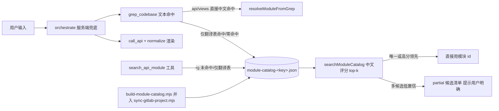

## 用户需求
落地「模块语义索引」方案（此前方案对比确认选择 X）：根治「账号合并」类纯 i18n 页面中文定位断链问题。核心担忧：后续新增项目架构（非 i18n/纯英文）不应再新增适配代码。

## 产品概述
将「模块发现」从实时 grep 文本匹配升级为「每项目自动构建的模块语义索引 + top-k 候选 + 模型裁决」：构建器从路由/翻译表/页面/接口四类源码锚点自动生成模块中文描述目录，检索器按中文评分返回候选，服务端兜底与 search_api_module 工具共用。

## 核心功能
- 构建器：扫描路由 meta.title 三形态（直接中文 / getTran / t('tranXX.xxx') i18n key）+ 翻译表解析 + views 页面与 configs.data.tsx 列中文 + api 操作清单，生成按项目隔离的 module-catalog-<key>.json
- 检索器：按 codebaseRoot 隔离加载，中文关键词评分返回 top-k 候选并格式化供模型裁决
- orchestrate 兜底：resolveModuleFromGrep 落空后查目录——唯一候选直接用、多候选按阈值防歧义、无候选保持诚实提示
- search_api_module 工具：rg 仅翻译表命中/零命中时改查目录，返回 [目录定位] 候选
- 新项目只需跑一次构建，不新增任何适配代码；目录全部源码自动生成、零手工词表、零新依赖


## 技术栈
- 现有 Node.js + TypeScript + LangGraph（apps/agent-server），零新依赖
- 构建脚本用 tsx 运行（可 import src 下 TS 模块，与 sync-gitlab-project.mjs 同模式）
- 数据产物：data/module-catalog-<key>.json（按项目隔离，key 含 codebaseRoot 语义）

## 实现方案
### 总体策略
模块定位链路从「grep 文本命中（api/views 直接中文）」升级为三级：① 现有 grep 文本命中（C1 硬编码中文，如「优惠活动配置」）；② 新增 module-catalog 目录检索（C2 纯 i18n，如「账号合并」——路由 meta.title + 翻译表解析出中文菜单名）；③ 仍落空则诚实提示。目录是**源码自动生成**（非手工词表），检索结果 top-k **交模型裁决**（工具路径）或服务端**阈值防歧义**（兜底路径），完全对齐「抛弃 aliases、不硬路由」红线。

### 关键决策与理由
- **构建器独立脚本 build-module-catalog.mjs**：不复用 generate-api-index.mjs（其 outFile 缺省不写盘、collectViewTitles 不处理 i18n key），内联其 api 扫描精简版（walkTsFiles/parseFile：exports、enum Api 路径、@description）。
- **路由 meta.title 三形态解析**：① `title: '黑名单管理'` 直接取；② `t(getTran('KEY','[中文]',...))` 取 getTran 第二参数；③ `t('tran40.menus.mzlyqkkqswmwrytb')` 拆 key → 文件 tran40.ts/json（routes/ 子目录同样兼容）→ 正则取 leaf 中文。内联 output-tools.ts 的 resolveI18nTitle 逻辑（该函数未导出，构建器内联 ~20 行独立实现）。
- **组件→api 关联**：从 component import 路径（`/@/views/account/accountMerge/List.vue`）读取页面源码提取 `@/api/xxx` import；取不到时按 views 目录名同名匹配 src/api 下文件。
- **多候选裁决（防误调红线）**：orchestrate 是纯规则兜底（chat.ts runServerFallback 已确认无模型调用、partial 仅回显），故多候选不能交模型。策略：top1 分数 >= 阈值（菜单名精确命中=10/包含=6）且领先 top2 >= 4 才直接用；否则 partial 返回候选清单提示用户明确（诚实兜底，不硬调）。
- **性能**：模块量级数百，检索线性评分毫秒级；per-path 缓存（仿 api-index.ts）避免重复读盘；构建一次性秒级，纳入 sync-gitlab-project.mjs 同步流程。

## 实现注意
- 红线一致：目录**只存源码自动发现的事实**（菜单中文/路由/页面列/接口路径），不叠加任何手工别名；构建产物按项目 key 隔离，避免多项目串扰（对齐 api-index.ts per-path 缓存先例）。
- 兼容性：rg 反斜杠与 grepCodebaseNative 正斜杠路径均需支持；翻译表 routes/ 子目录 ts/json 混合需同时探测；hideMenu 路由（如 /account/edit/:id）纳入但标注，供详情查询。
- 低置信不硬调：避免重蹈当年 termIndex「查询→paymentChannel」误命中事故；无候选时维持现有「未找到」提示不误报。

## 架构设计


## 目录结构
```
apps/agent-server/
├── scripts/
│   ├── build-module-catalog.mjs        # [NEW] 构建器：扫路由+翻译表+views+api → module-catalog-<key>.json；tsx 运行；内联 api 扫描与 resolveI18nTitle
│   └── verify-module-catalog.mjs       # [NEW] 验证脚本：断言「账号合并→user/account_merge」「优惠活动配置→user/special_offer」「用户列表→account」「影片搜索统计→search」
├── src/
│   ├── module-catalog.ts               # [NEW] 检索器：ModuleCatalogEntry 类型 + loadModuleCatalog（per-path 缓存，key 含 codebaseRoot）+ searchModuleCatalog（评分 top-k≤5）+ formatCatalogCandidate（候选文本）
│   ├── workflow-orchestrate.ts         # [MODIFY] 929 行 resolveModuleFromGrep 落空后接入目录兜底（唯一/阈值/候选清单三分支）
│   └── tools.ts                        # [MODIFY] search_api_module 1663-1739：rg 无 useful 命中分支改查 catalog，返回 [目录定位] 候选供模型裁决
└── data/
    └── module-catalog-<key>.json       # [NEW] 构建产物（.gitignore 视需要）
apps/agent-server/scripts/sync-gitlab-project.mjs  # [MODIFY] 同步代码后自动跑 build-module-catalog
docs/agent/README.md                    # [MODIFY] 流程改进日志（日期+模块+要点+改动文件）
```
说明：旧 data/module-api-catalog.json（静态目录，运行时已无引用）本次不动，避免无关重构。

## 关键代码结构
```ts
// src/module-catalog.ts 核心类型与检索签名（多模块依赖，需精确）
interface ModuleCatalogEntry {
  id: string;              // user/account_merge
  route: string;           // /account/merge
  menuTitles: string[];    // ['账号合并']（路由 meta.title 解析结果）
  component: string;       // views/account/accountMerge/List.vue
  apiFiles: string[];      // ['user/account_merge.ts']
  operations: Array<{ id: string; method: string; path: string }>;
  pageTitles: string[];    // 页面/列中文（configs.data.tsx + List.vue）
  descriptions: string[];  // @description 注释
}
export function loadModuleCatalog(root?: string): ModuleCatalog;   // per-path 缓存
export function searchModuleCatalog(query: string, root?: string): ModuleCatalogEntry[]; // 评分 top-k
export function formatCatalogCandidate(m: ModuleCatalogEntry): string; // 供模型/兜底提示
```
评分权重：menuTitles 精确=10/包含=6；id 精确=8/包含=3；pageTitles 精确=6/包含=3；route/apiFiles 包含=3；descriptions 包含=1。


## Agent Extensions
### Skill
- **agent-browser**
  - Purpose: 端到端回归验证——登录 web 前端（vite 5173，测试账号 admin/123456）实际发送「账号合并 5585230699772928」等请求，验证 catalog 兜底链路与中文表头渲染
  - Expected outcome: 「账号合并」请求返回用户ID1/用户ID2/合并后ID/登录方式/是否会员中文表头及数据；「优惠活动配置」「用户列表」「影片搜索统计」无回归；「你好」闲聊正常
