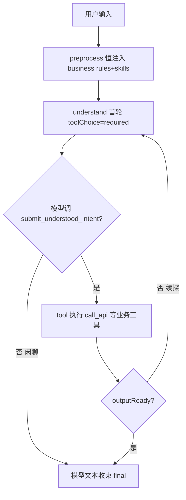

## 用户需求
用户输入「留存报表看最近 30 天」被误判为闲聊，输出了 chit-chat 引导文案，未走业务查询链路。根因是 `tool-gate.ts` 的 `isActionableBusinessQuery` 业务动词白名单漏了「看」等口语词，导致大量口语化业务请求被服务端硬预判枪毙。用户拒绝「缺一个补一个」的打地鼠式修法，要求通用方案。

## 产品概述
将业务/闲聊的判别权从服务端硬编码正则（`isActionableBusinessQuery` 的路由用途）彻底移交给大模型，使任何口语化业务表述（如「看最近30天」「瞅一下留存」「拉一下用户列表」）都能正确进入业务编排链路，不再因动词白名单不全而误入闲聊。

## 核心特性
- 摘除 `isActionableBusinessQuery` 在 chat 主流程中的「路由判决」用途（注入 rules/skills、首轮 toolChoice、条件边续探/收束）。
- 业务与非业务的判别 100% 交模型：始终注入业务 rules 与 skills 清单，首轮强制调 `submit_understood_intent`，模型自主决定调工具还是纯文本收束。
- 保留 `isActionableBusinessQuery` 仅作「服务端兜底编排/日志」信号（非路由），避免误删引发回归。
- 「留存报表看最近30天」等口语业务请求正确走 `understand → call_api` 链路；「你好」等闲聊由模型自然文本收束，不再误报业务失败文案。


## 技术栈
- 现有项目：`apps/agent-server`（Node.js + TypeScript + LangGraph StateGraph 编排）
- 仅修改 `chat.ts` 主流程的路由判定逻辑；`tool-gate.ts` 的 `isActionableBusinessQuery` 函数保留但摘除路由用途（符合「不维护映射表、规则不抢路由」红线 design.md §7.4）

## 实现方法
核心策略：把 `actionableQuery` 从「生杀大权的路由 bool」降级为「兜底/日志信号」。模型在 `understand` 节点基于始终注入的 business rules + skills 清单自主判断该调工具还是闲聊收束，服务端不再用 `false` 提前枪毙（当前第 1735 行 `!actionableQuery && !toolCalls → final` 会剥夺模型自救机会）。

关键技术决策与取舍：
1. **preprocess 节点（第 1116 行）**：`if (actionableQuery)` 改为恒注入 resident rules + skills 清单。skill 清单本就有 16k 预算护栏（第 1136 行 `SKILL_CATALOG_BUDGET`），闲聊多注入开销可控。
2. **首轮 toolChoice（第 1260 行）**：改为恒 `"required"`（首轮强制 `submit_understood_intent`，与现有业务首轮语义一致；模型提交理解后自主决定续探或收束）。
3. **条件边续探（第 1730 行）**：`shouldContinue` 去掉 `actionableQuery` 约束，改为 `!state.outputReady && state.round < MAX_TOOL_ROUNDS && !gaveFinalText`。
4. **条件边收束（第 1735 行）**：`!actionableQuery && !toolCalls.length → final` 改为统一 `!state.toolCalls.length → final`（模型不调工具即收束，闲聊自然结束，业务请求若模型不调工具也安全收束）。
5. **保留非路由用途**：第 1833/1926 行 fallback 触发（业务失败才走规则兜底，合理保留）、第 1322 伪计划清空、第 1244 首轮流式开关、第 1316 日志——这些不是路由判决，保留 `actionableQuery` 变量仅作信号。
6. **删除 preprocess 的 chit-chat 分支（第 1164-1176 行）**：不再针对 `actionableQuery=false` 注入 `[workflow/chit-chat]` 薄提示，统一走业务提示（模型自主判别闲聊）。如担心闲聊 token 浪费，可在 system 提示中加一句「若用户仅打招呼/闲聊，直接文本回复不调工具」作为护栏（不抢路由，仅作提示）。

性能与可靠性：改动为「逻辑分支放宽」，不引入新模型调用轮次；闲聊句因首轮 `required` 会多一次 `submit_understood_intent` 调用，但模型不调后续工具即收束，延迟增加可忽略（一次轻量 tool call）。避免技术债：复用现有 `loadSkills`/`loadResidentRules` 机制，不新增映射表。

## 实现注意事项
- 第 982 行 `const actionableQuery = isActionableBusinessQuery(userText);` 保留（后续 fallback/日志仍用），仅在路由相关 4 处（1116/1260/1730/1735）摘除其影响，不要全局删除变量以免破坏 1833/1926/1322/1244/1316 引用。
- `tool-gate.ts` 的 `isActionableBusinessQuery` 函数体保留，仅在注释中说明「不再用于路由判决，仅作 fallback/日志信号」，避免误删引发回归。
- 第 1164-1176 行 chit-chat 分支删除后，需确认 `preprocess` 节点在 `actionableQuery` 为 false 时仍走 `if (actionableQuery)` 的注入路径（即恒注入）。
- 日志（第 1316 行）保留 `actionableQuery` 埋点，便于回归对比误判率。

## 架构设计
现有 LangGraph 编排结构不变（START → preprocess → understand ⇄ tool → final → END）。仅调整 preprocess 注入策略与 understand/final 条件边判定，使业务/闲聊判别下沉到模型。



## 目录结构
```
apps/agent-server/src/
├── chat.ts          # [MODIFY] 摘除 actionableQuery 路由用途：preprocess 恒注入（1116）、首轮 toolChoice 恒 required（1260）、条件边 shouldContinue 去约束（1730）、条件边收束统一按 toolCalls（1735）、删除 chit-chat 分支（1164-1176）。保留 fallback/日志用途（1833/1926/1322/1244/1316）。
└── tool-gate.ts     # [MODIFY] isActionableBusinessQuery 函数保留，仅更新注释说明其不再用于路由判决、仅作 fallback/日志信号（路由用途已在 chat.ts 摘除）。函数体逻辑不变。
```

## 关键代码结构
无需新增接口/类型；仅调整 `chat.ts` 中 `actionableQuery` 的使用方式（变量保留，路由分支放宽）。

